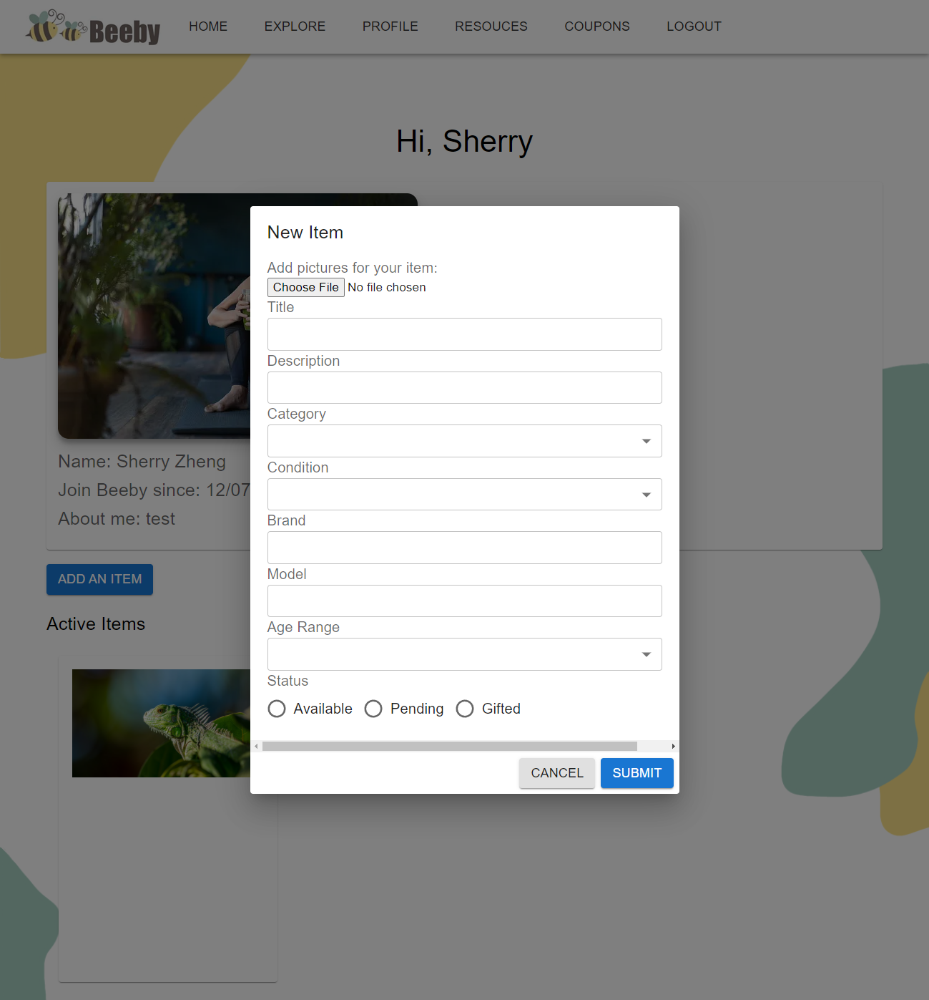
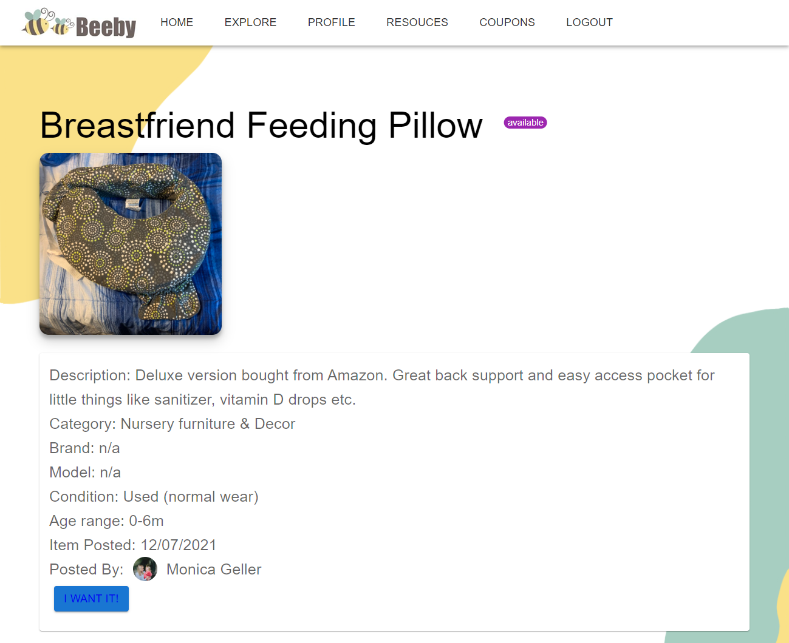

# BeeBy Backend 
## Description

## *This is the backend of Beeby app*

Beeby is an online swap platform purely built for parents and families to exchange items and help others in needs.

As busy parents, it's always nice to have an app that is simple and easy to swap their unwanted baby related items and get something they are in need (baby grows so fast!), yet in the social media app it is very inefficient and difficult to communicate.

So we created Beeby, a swap platform that support parents and families to share and save, and create a sustainable community for their little ones.

## Visit the app [here!](https://beeby-backend.herokuapp.com/)

## A Quick Look of the app

## Questions? Contact Us [Here](mailto:beebycontact@gmail.com)
